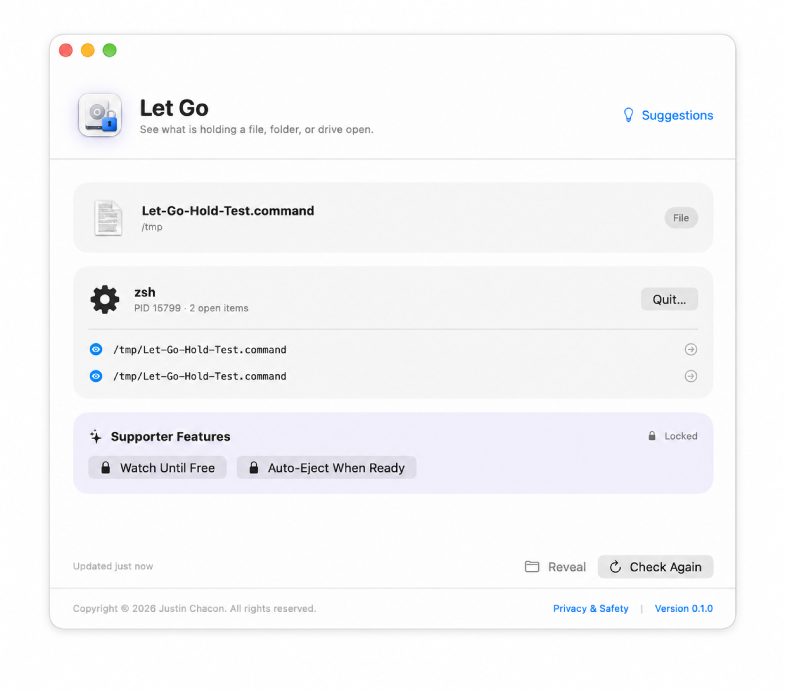

# Let Go


**See what is holding a file, folder, or drive open on your Mac.**

Let Go is a lightweight, privacy-first macOS utility for the moment Finder says an item is in use but does not tell you why. Drop in an item—or click the drop area—and Let Go shows the apps and background processes currently using it.



## Download

[Download Let Go v0.1.0 for macOS](https://github.com/dHakZz/let-go-macos/releases/download/v0.1.0/Let-Go-macOS.zip)

Requires macOS 13 Ventura or later. The universal build supports Apple silicon and Intel Macs.

This first public build is ad-hoc signed and is not yet notarized. After moving **Let Go** to Applications, right-click it and choose **Open** the first time.

## What it does

- Checks a file, folder, or mounted drive on demand.
- Identifies the responsible app or background process.
- Shows the exact paths a process has open.
- Reveals an open item in Finder.
- Sends a normal quit request to a process owned by the current user.
- Safely ejects an external volume when nothing is using it.
- Starts a check from Finder's **Services → Check What’s Using This** command.
- Never uploads the files, paths, or results you inspect.

The interface also previews two planned supporter features—**Watch Until Free** and **Auto-Eject When Ready**. Payment and activation are not connected in v0.1.0, so these controls remain locked.

## Try it with a known open file

[Download the Hold Test helper](https://github.com/dHakZz/let-go-macos/releases/download/v0.1.0/Let-Go-Hold-Test.zip), unzip it, and double-click **Let-Go-Hold-Test.command**. Leave its Terminal window open, then choose that same file in Let Go. The app should identify `zsh` as the process holding it. Press Return in Terminal to release the file.

## Privacy

Inspections happen locally and only when you ask. Let Go does not scan continuously or upload inspected file names, paths, contents, or results. Suggestions are sent only when you press **Send Suggestion** and are delivered through FormSubmit. Read the full [Privacy & Safety policy](PRIVACY.md).

## Build from source

Requirements: macOS 13 or later and Xcode with the macOS SDK.

```sh
zsh Scripts/test.sh
zsh Scripts/build-app.sh
```

The packaging script creates a universal Intel/Apple silicon archive at `outputs/Let-Go-macOS.zip`.

To configure a support page while packaging:

```sh
LETGO_SUPPORT_URL="https://your-support-page.example" zsh Scripts/build-app.sh
```

## Project status

Let Go is an early public preview. Suggestions are welcome through the link in the app. See [CHANGELOG.md](CHANGELOG.md) for release notes.

Copyright © 2026 Justin Chacon. All rights reserved. Source is published for transparency and review; see [LICENSE](LICENSE) for permitted use.
