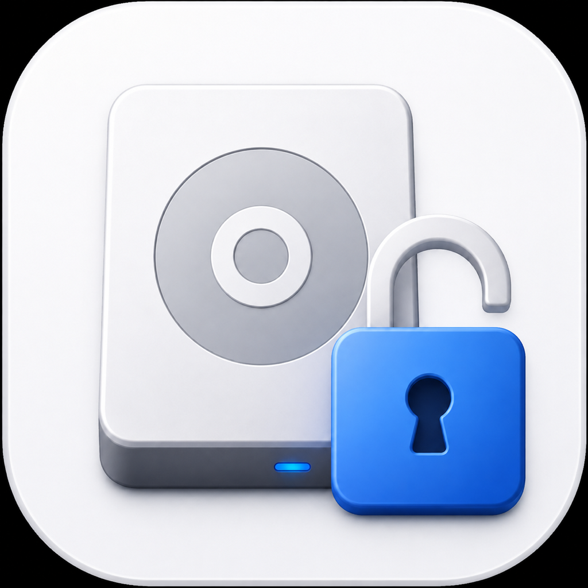

# Let Go



**See what is holding a file, folder, or drive open on your Mac.**

Let Go is a lightweight, privacy-first macOS utility for the moment Finder says an item is in use but does not tell you why. Drop in an item—or click the drop area—and Let Go shows the apps and background processes currently using it.

## Download

[Download the latest Let Go release for macOS](https://github.com/dHakZz/let-go-macos/releases/latest)

Requires macOS 13 Ventura or later. The universal build supports Apple silicon and Intel Macs.

The currently published v0.1.0 build is ad-hoc signed and is not yet notarized. A Developer ID signed and notarized v0.1.1 build is being prepared before the next round of promotion.

## What it does

- Checks a file, folder, or mounted drive on demand.
- Identifies the responsible app or background process.
- Shows the exact paths a process has open.
- Reveals an open item in Finder.
- Sends a normal quit request to a process owned by the current user.
- Safely ejects an external volume when nothing is using it.
- Watches a busy item and notifies you as soon as it is free.
- Automatically ejects an external drive as soon as it is safe.
- Starts a check from Finder's **Services → Check What’s Using This** command.
- Never uploads the files, paths, or results you inspect.

**Watch Until Free** and **Auto-Eject When Ready** are included for everyone. If a support link is configured in a release build, it is an optional thank-you and never unlocks or restricts app features.

## Screenshots

The v0.1.1 screenshots are being refreshed after the signed and notarized release build is complete. The previous images were removed because they showed the retired locked-feature preview.

## Try it with a known open file

[Download the Hold Test helper](https://github.com/dHakZz/let-go-macos/releases/download/v0.1.0/Let-Go-Hold-Test.zip), unzip it, and double-click **Let-Go-Hold-Test.command**. Leave its Terminal window open, then choose that same file in Let Go. The app should identify `zsh` as the process holding it. Press Return in Terminal to release the file.

## Privacy

Inspections happen locally and only when you ask. Let Go does not scan continuously or upload inspected file names, paths, contents, or results. Suggestions are sent only when you press **Send Suggestion** and are delivered through FormSubmit. Read the full [Privacy & Safety policy](PRIVACY.md).

## Build from source

Requirements: macOS 13 or later and Xcode with the macOS SDK.

```sh
zsh Scripts/test.sh
zsh Scripts/build-app.sh
```

The packaging script creates a universal Intel/Apple silicon archive at `outputs/Let-Go-macOS.zip`. Without release credentials it creates an ad-hoc signed development build.

To configure a support page while packaging:

```sh
LETGO_SUPPORT_URL="https://your-support-page.example" zsh Scripts/build-app.sh
```

The support link is hidden when no URL is configured. For the Developer ID signing and notarization workflow, see [DISTRIBUTION.md](DISTRIBUTION.md).

## Project status

Let Go v0.1.1 is being prepared as the first signed and notarized update. Suggestions are welcome through the link in the app. See [CHANGELOG.md](CHANGELOG.md) for release notes.

Copyright © 2026 Justin Chacon. All rights reserved. Source is published for transparency and review; see [LICENSE](LICENSE) for permitted use.
